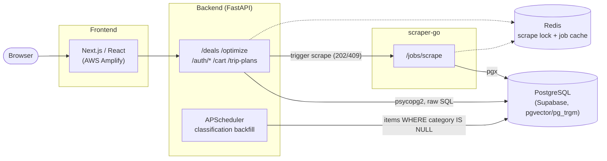

# Grocery-Store-Deal-Tracker

A Canadian grocery-flyer deal tracker: pulls weekly flyer data for major chains, lets users browse and price-compare deals scoped to their postal code, chart price history, and turn a shopping list into an optimized, multi-store trip plan.

**Live demo: [https://main.d2r4twoc6raa07.amplifyapp.com/](https://main.d2r4twoc6raa07.amplifyapp.com/)**

---

## Overview

The app scrapes flyer data from the Flipp API for chains like Walmart, Metro, Loblaws, FreshCo, Food Basics, Farm Boy, Real Canadian Superstore, and Independent Grocer, scoped to a user's postal code and chosen stores. From there, users can:

- Browse and filter current deals (category, store, price, expiry, price-per-unit)
- Track 30-day price history for individual items
- Build a grocery list and get an **optimized shopping plan** — cheapest total cost, or fewest stops
- Keep a cart and saved trip plans that sync across devices once signed in

## Features

- Deals grid with category/store/price/expiry facets and price-per-unit normalization
- Per-item price history charts (Recharts)
- Shopping-list optimizer: exact subset search over up to 15 stores, greedy fallback beyond that, with singular/plural-tolerant matching and classifier-assisted category disambiguation
- Server-backed cart and saved trip plans, with an anonymous localStorage fallback that auto-migrates into the account on first sign-in
- Auth via email/password (bcrypt) or Google OAuth2, with CSRF-safe state binding and `email_verified` enforcement
- ML-classified item categories (TF-IDF + logistic regression, and a fastText model), backfilled asynchronously as new items arrive
- Mobile-first responsive header — a horizontally-scrollable "peeking" nav strip on small screens instead of cramped wrapping
- A from-scratch three.js watermelon-slicing minigame plus animated hero/corner widgets, isolated from the main JS bundle
- A Konami-code easter egg on the deals page

## Architecture

A polyglot, multi-service system rather than a typical two-tier app: a Next.js/TypeScript frontend, a Python/FastAPI backend, and a standalone Go microservice that owns flyer scraping.



The backend talks to Postgres directly via `psycopg2` (raw SQL, no ORM) and to `scraper-go` over internal HTTP — a fire-and-forget trigger (`POST /jobs/scrape` returns 202/409 immediately) rather than a blocking call. `scraper-go` is never exposed publicly; Redis coordinates a single-flight lock between them so concurrent triggers don't double-scrape, and caches job state so a scrape survives a crashed caller.

## Tech stack

| Layer | Stack |
|---|---|
| **Frontend** | Next.js 16 (App Router), React 19, TypeScript, Tailwind CSS v4, Recharts, three.js (self-hosted), Vitest + Playwright, Storybook |
| **Backend** | Python 3.10, FastAPI, Uvicorn, psycopg2 (raw SQL), PyJWT + bcrypt, scikit-learn + fastText, APScheduler, Resend |
| **Scraper** | Go 1.25, stdlib `net/http`, pgx, go-redis |
| **Data / infra** | PostgreSQL (Supabase, pgvector + pg_trgm), Redis 7, Caddy 2, Docker Compose |

## Production architecture

- **Frontend** — deployed on AWS Amplify Hosting, git-triggered builds.
- **Backend, scraper-go, Redis, Caddy** — self-managed on a single EC2 instance via `docker-compose.prod.yml`. Caddy terminates automatic Let's Encrypt HTTPS at `grocerytracker.duckdns.org` and reverse-proxies to the backend by Compose service name (`reverse_proxy backend:8000`) — Compose's embedded DNS resolves that name to every running replica, so `docker compose up --build --scale backend=3` horizontally scales the stateless FastAPI tier (JWT auth, no server-side sessions, pooled DB connections) without touching the Caddyfile. `scraper-go` is deliberately scaled to exactly 1 (`--scale scraper-go=1`) instead — see below.
- **Database** — Supabase-managed Postgres, free tier (500 MB).

The free-tier/single-instance constraints below aren't oversights — they're handled explicitly in code.

## Design decisions

**Splitting the scraper into Go.** Flyer fetch/parse/persist is a pipeline of concurrent HTTP fetches feeding CPU-bound parsing — real parallel work, not just I/O waiting. Python threads can't run that in parallel across cores (the GIL serializes the CPU-bound half regardless of thread count), and multiprocessing would mean IPC overhead for what's fundamentally one small pipeline. `scraper-go` runs it as an actual producer/consumer chain instead (`scrape.go`'s `rawCh`/`parsedCh` channels + `WaitGroup`, a bounded semaphore in `client.go` capping concurrent fetches) — goroutines give real OS-thread parallelism for both halves at once, plus a small static binary as a side benefit. Unlike the backend, `scraper-go` is deliberately run as a single replica: its Redis lock is single-flight by design (below), so more replicas wouldn't increase scrape throughput, only risk racing each other. ML classification deliberately stays in Python — there's no practical scikit-learn/fastText equivalent in Go — so `scraper-go` writes items with `category`/`subcategory` left `NULL`, and an async APScheduler job in the backend sweeps `items WHERE category IS NULL` on a timer. The split is by runtime capability, and the decoupled backfill makes it resilient to whichever service wrote the row.

**Region-scoped deduplication.** Items were originally deduped per raw postal code, but Flipp serves one flyer to many nearby postal codes — at the time this was found, that meant 7,006 duplicate rows out of 15,906 in `items` (44% of the table), e.g. one flyer duplicated across 5 Ottawa postal codes. `db/migrations/001_flyer_scoped_items.sql` reworked dedup to key off `flyer_id` via a new `flyer_postal_codes` junction table, re-pointing `price_history` onto the surviving rows before deleting the duplicates so no item's price chart was lost.

**Distributed correctness via Redis.** The scraper's single-flight scrape lock is fail-closed — it refuses to boot without Redis, since a duplicate scrape is expensive. The backend's classification-backfill claim is fail-open (SETNX-based) — losing that race just means a batch is skipped until the next tick, which is cheap to recover from. Same coordination primitive, different failure mode, chosen by what a double-run actually costs.

**Server-backed cart with identity migration.** Anonymous carts live in `localStorage`. On sign-in, the client identity switches from `"anon"` to `"u<id>"` and the cart source switches to Postgres via `GET`/`PUT /cart`, one-time-migrating that identity's pre-existing local bucket. There's no merge-on-sign-in by design — a guest's cart is simply left behind — and a ref-based guard stops a hydration render from racing a stale write under the wrong identity.

**Graceful degradation on a free-tier database.** `db/guard.py`'s `@graceful_write` decorator catches the Postgres SQLSTATEs Supabase's free-tier over-quota mode raises (`53xxx` insufficient-resources, `25006` read-only), drops the write, logs it, and flags `/health` as `"degraded"` — reads keep working instead of the API going down. Paired with a retention job (`backend/maintenance/prune.py`) to reclaim space.

**Two classifier models, same interface.** `classify.py` (TF-IDF + logistic regression, trained on `training_data/instacart_labeled.csv`) is the primary model. `classify_fasttext.py` predicts the same categories at aisle level (134 classes, with a derived aisle→department lookup) using word embeddings + byte-level character n-grams instead of TF-IDF — added specifically for the cases TF-IDF handles poorly: brand-only names ("Nescafé Gold" → coffee), out-of-vocabulary words ("Dragonfruit" → fresh fruits, via the substring "fruit"), and non-English characters. Both expose the identical `classify_item`/`classify_batch` API so either can be swapped in without touching a call site, and `classify_fasttext.py --compare` benchmarks the two against each other directly.

**Custom JWT auth over Supabase Auth.** Sessions are lightweight HS256 bearer tokens issued directly by FastAPI against local `app_users`/`user_merchants` tables, rather than Supabase's RLS-based auth tables (still present in the schema, documented as superseded). Simpler ownership of the auth flow, one fewer system in the request path.

**Isolating three.js from the main bundle.** The watermelon widgets are standalone static HTML files under `frontend/public/`, embedded via same-origin iframes instead of React components, specifically so three.js never enters the Next.js bundle. Mobile gates them out via `matchMedia` rather than CSS `hidden`, so phones never allocate a WebGL context for them at all.

**Single Uvicorn worker in production.** `backend/Dockerfile.prod` runs `--workers 1` — a deliberate trade-off for a 1 GB free-tier EC2 instance, since scikit-learn/fastText/pandas would otherwise be reloaded per worker.

## Local development

```bash
# Backend
cd backend
source venv/bin/activate
uvicorn main:app --reload

# Frontend
cd frontend
npm run dev

# Full stack
docker compose up --build
```

Copy `.env.example` to `.env` and fill in `DATABASE_URL`/`SUPABASE_PASSWORD`, `JWT_SECRET`, `GOOGLE_CLIENT_ID`/`GOOGLE_CLIENT_SECRET`, `SCRAPER_SERVICE_URL`/`SCRAPER_SERVICE_TOKEN`, `REDIS_URL`, and (optionally) `RESEND_API_KEY`.

Scrapes normally run through `scraper-go`, triggered by the backend. The legacy in-process scraper can still be run standalone for testing: `python -m flipp_scraper.run --output results.json`.

## Project structure

```
frontend/     Next.js app — src/app, src/components, src/lib
backend/      FastAPI app — routing, auth, cart/plans, optimizer, ML classifier, DB access
scraper-go/   Go microservice — Flipp fetch/parse/persist
proxy/        Caddy reverse-proxy configs (dev + prod)
```

## License

MIT — see [LICENSE](LICENSE).
